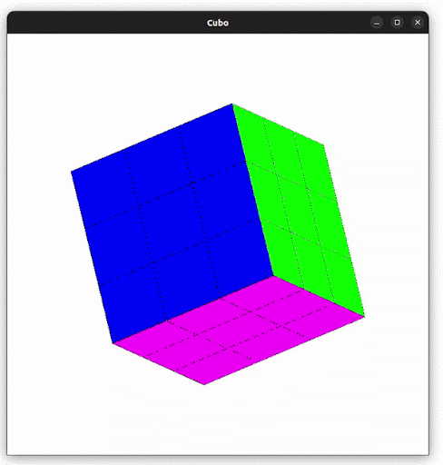
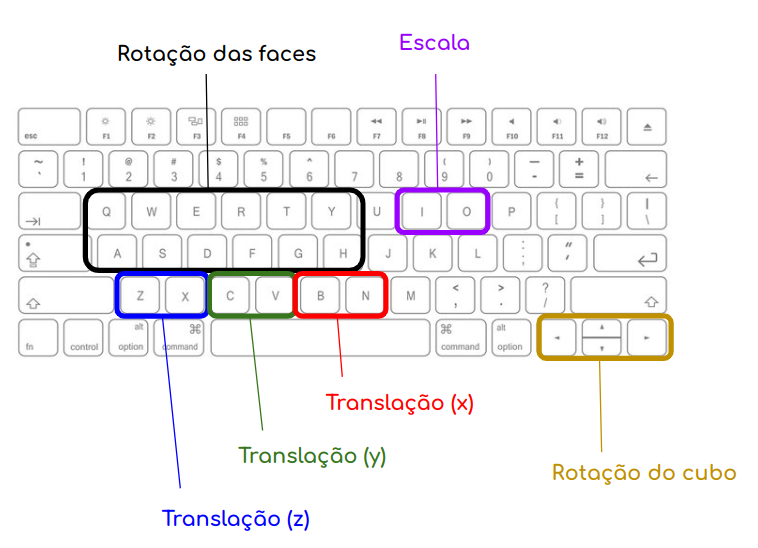

# 3D Rubik's Cube

## Description

This is a 3D Rubik's Cube made with Python and PyOpenGL. It is a project for the Computer Graphics course at the University of São Paulo.

The file `Assignment.pdf` contains the assignment specification in portuguese while `Presentation.pdf` was used in a presentation to the class.

## How to run
  
  The main file is `cube.py`. 
  
  After downloading all the required packeges, just type the following command in the terminal from the root directory of the project:

  ```bash
  $ python3 cube.py
  ```

## Preview

<p align="center">
  
</p>

## User input

<p align="center">
  
</p>
